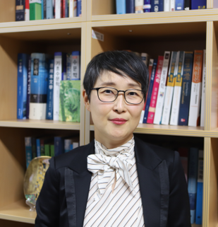
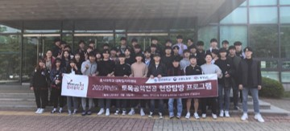
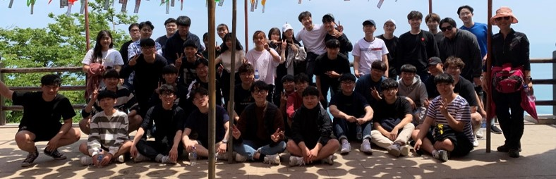

+---------------------------------------------------------------------------------------------------------------------------------------------------------------------------------------------------------------------+:---------------------------------------------------------------------------------------------------------------------------------------------------------------------------------------------------------------:+
| 호서대학교 수자원연구실은 토목공학전공 중 수자원분야를 연구하는 연구실이며, 2013년 이후 기후변화에 따른 홍수 및 가뭄, 겨울철 대설재난 피해 저감 등 다양한 자연재해 피해 예측 및 저감 관련 연구를 수행하고 있습니다. |                                                                                                                                                                                          |
|                                                                                                                                                                                                                     |                                                                                                                                                                                                                 |
| 수자원연구실 졸업생들은 박사과정에 진학해 공부를 하거나, SH공사, 설계회사 등에 취업하여 실무에서 열심히 국민 삶의 질 향상에 기여하고 있습니다.                                                                      | 지도교수 정건희                                                                                                                                                                                                 |
|                                                                                                                                                                                                                     |                                                                                                                                                                                                                 |
| 수자원연구실에서는 건축토목공학부 학부생을 대상으로 '오아시스'라는 수자원동아리를 만들어 학부생들에게 수자원공학과 자연재해 관련 지식 전달에 힘쓰고 있습니다.                                                       |                                                                                                                                                                                                                 |
+---------------------------------------------------------------------------------------------------------------------------------------------------------------------------------------------------------------------+-----------------------------------------------------------------------------------------------------------------------------------------------------------------------------------------------------------------+

+:----------------------------------------:+:------------------------------------------:+
| {width="331"}      | {width="467"}        |
|                                          |                                            |
| 2019년 수자원 동아리 '오아시스' 현장견학 | 2018년 수자원 동아리 '오아시스' 현장견학   |
+------------------------------------------+--------------------------------------------+

